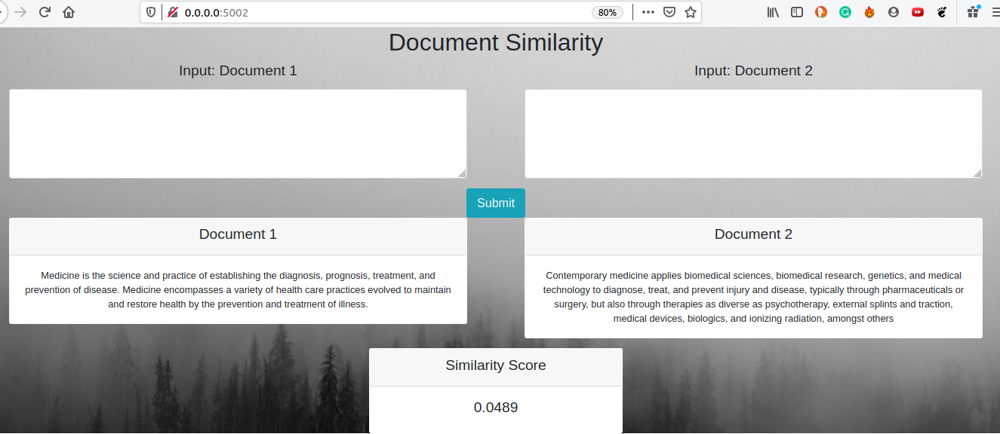

# :rocket: Document similarity measurement and web api

- This simple project creates Document Similarity Score (using `tfidf`) and exposes them as a simple flask api with a minimal bootstrap framework.
- The bigger goal is to re-use this web framework to showcase any other NLP task
- In future, this project can be containerized into Docker very easily and can be deployed in Heroku as a fun exercise.     

## Start server

From the parent directory run `python app.py` and open [http://0.0.0.0:5002/](http://0.0.0.0:5002/)

The final output will look something like this:

## Simple Bootstrap elements

Another major objective of this fun project is to learn simple web development, enough for show casing your NLP work. Here is a list of bootstrap elements, which helped a lot to achieve this.

- [Grid](https://getbootstrap.com/docs/4.1/layout/grid/)
  - [link 2](https://www.w3schools.com/bootstrap/bootstrap_grid_system.asp)
- [Button](https://www.w3schools.com/bootstrap/bootstrap_buttons.asp)
- [Card](https://getbootstrap.com/docs/4.0/components/card/)
- [Forms](https://www.w3schools.com/bootstrap/bootstrap_forms.asp)
- [Examples](https://www.w3schools.com/bootstrap/bootstrap_examples.asp)

### TO-DO

- [ ] Apply [simple theme](https://www.w3schools.com/bootstrap/bootstrap_theme_me.asp)

----
